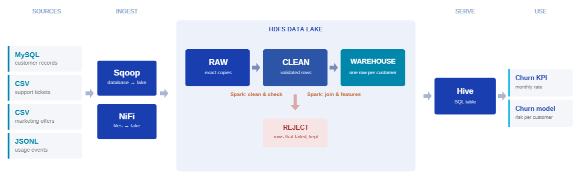
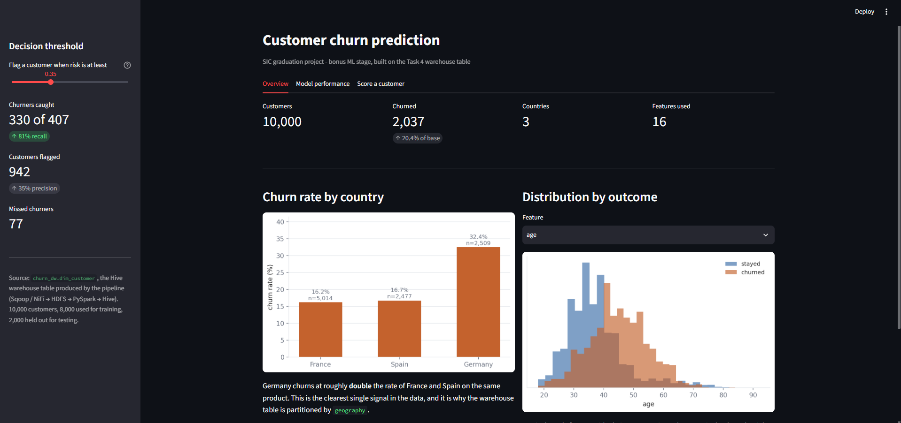
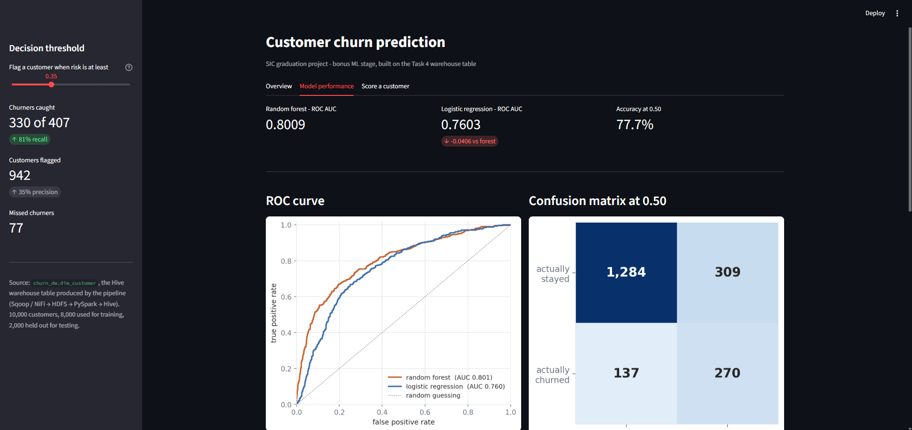
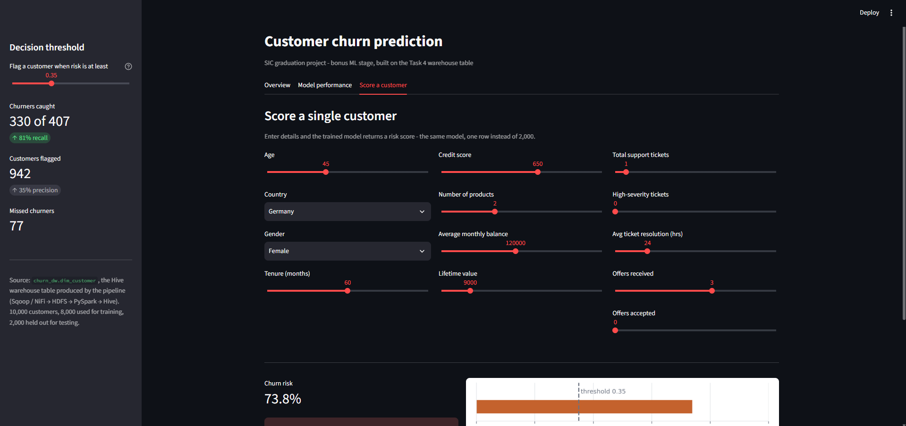

<h1 align="center">Customer Churn Data Pipeline</h1>

<p align="center">
  An end-to-end big-data pipeline that turns four disconnected source systems into one queryable warehouse,<br>
  a monthly churn KPI, and a churn-risk model.
</p>

<p align="center">
  
  
  
  
  
  
  
</p>

<p align="center">
  <b>10,000 customers</b> &nbsp;·&nbsp; <b>4 sources</b> &nbsp;·&nbsp; <b>4 data-lake zones</b> &nbsp;·&nbsp;
  <b>6m 37s</b> end to end &nbsp;·&nbsp; <b>one command</b>
</p>

---

## Contents

- [What this solves](#what-this-solves)
- [Architecture](#architecture)
- [Screenshots](#screenshots)
- [Repository layout](#repository-layout)
- [Quick start](#quick-start)
- [The seven stages](#the-seven-stages)
- [The warehouse](#the-warehouse)
- [The KPI](#the-kpi)
- [Results](#results)
- [Bonus: churn model and Streamlit app](#bonus-churn-model-and-streamlit-app)
- [Design decisions](#design-decisions)
- [Deliverables](#deliverables)
- [Known limitations](#known-limitations)
- [Team](#team)

---

## What this solves

A retail bank loses roughly a fifth of its customers, and the evidence of why is scattered across four systems that were never designed to be joined:

| System | Format | What it holds |
|---|---|---|
| `customers` | MySQL table | 10,000 accounts: age, country, tenure, balance, and whether they left |
| Support tickets | CSV | every complaint raised, its severity, how long it took to close |
| Marketing offers | CSV | which retention offers were sent, and which were accepted |
| Usage activity | JSON lines | login and session events, one nested record at a time |

No single place existed where anyone could ask **who is leaving, and what do they have in common.**

This pipeline collects all four, validates them, joins them into one row per customer, and publishes a warehouse that answers that question in SQL.

---

## Architecture

```
                     ┌──────────────┐
   MySQL             │              │
   (customers)  ────►│    SQOOP     │──┐
                     │              │  │
                     └──────────────┘  │
                                       ▼
   support_tickets.csv   ┌──────────┐  ┌───────────────────────────────────┐
   offers.csv       ────►│   NiFi   │─►│           HDFS DATA LAKE          │
   usage.jsonl           │ GetFile  │  │                                   │
                         │ PutHDFS  │  │  raw/ ──► clean/ ──► warehouse/   │
                         └──────────┘  │             │                     │
                                       │             └──► reject/          │
                                       └───────────────────────────────────┘
                                                │                 │
                                          PySpark ETL        Hive external
                                       (clean + features)    table (Parquet,
                                                          partitioned by country)
                                                                  │
                                            ┌─────────────────────┴─────────────┐
                                            ▼                                   ▼
                                    Monthly churn KPI               dim_customer.csv
                                     (HiveQL)                               │
                                                                            ▼
                                                                   Random forest +
                                                                   Streamlit app
```

### Four zones, one job each

| Zone | Format | Purpose |
|---|---|---|
| `raw/` | as received | Immutable landing area. Never edited — it is the audit trail. |
| `clean/` | Parquet | Typed, deduplicated, referentially valid. |
| `warehouse/` | Parquet, partitioned | Feature-enriched, query-ready, exposed through Hive. |
| `reject/` | Parquet | Quarantined rows **with the reason attached** — bad data is never silently dropped. |

Splitting the lake into zones means every stage has one job and one output. When a number looks wrong, you walk backwards zone by zone and find the exact stage that broke it.

---

## Screenshots

### The pipeline, end to end

<p align="center">
  
</p>

### The Streamlit app

<table>
  <tr>
    <td width="50%"></td>
    <td width="50%"></td>
  </tr>
  <tr>
    <td align="center"><b>Overview</b> — churn by country, feature distributions</td>
    <td align="center"><b>Model performance</b> — ROC, confusion matrix, importances</td>
  </tr>
  <tr>
    <td colspan="2"></td>
  </tr>
  <tr>
    <td colspan="2" align="center"><b>Score a customer</b> — the trained model on one row</td>
  </tr>
</table>

---

## Repository layout

```
sic-churn-data-pipeline/
├── data_sources/
│   ├── Churn_Modelling.csv            # source dataset, loaded into MySQL
│   └── support_tickets_rekeyed.csv    # tickets re-keyed to customer_id
├── nifi/
│   └── chrun_ingestion.xml            # NiFi flow template (GetFile → PutHDFS)
├── scripts/
│   ├── generate_data.py               # synthesises offers + usage (seed 42)
│   ├── ingest_sqoop.sh                # MySQL → HDFS raw
│   ├── etl_clean.py                   # raw → clean (+ reject)
│   ├── etl_features.py                # clean → warehouse
│   └── run_pipeline.sh                # all seven stages, one command
├── sql/
│   ├── mysql_schema.sql               # source table DDL + data load
│   ├── hive_ddl.sql                   # warehouse external table
│   └── kpi_monthly_churn.sql          # the monthly churn KPI
├── churn-app/                         # bonus: Streamlit app
│   ├── app.py
│   ├── dim_customer.csv               # warehouse table, exported
│   ├── requirements.txt
│   └── SIC_churn_prediction.ipynb     # model development notebook
├── docs/screenshots/
├── Task Validation.ipynb
└── README.md
```

> **A note on paths:** `data_sources/` holds the committed source files. The pipeline's working directory is `$HOME/data` and is not tracked. Generated and intermediate data never enters the repository.

---

## Quick start

### Prerequisites

Hadoop 3 (HDFS + YARN) · Spark 3 with PySpark · Hive 3 · Sqoop with the MySQL JDBC connector · MariaDB · Python 3 with pandas

### Run everything

```bash
git clone https://github.com/yeagx/sic-churn-data-pipeline.git
cd sic-churn-data-pipeline

# start the services
sudo systemctl start mariadb
su - hadoop -c "start-dfs.sh && start-yarn.sh"
jps    # expect NameNode, DataNode, SecondaryNameNode, ResourceManager, NodeManager

# run all seven stages
bash scripts/run_pipeline.sh
```

**Runtime: 6 minutes 37 seconds** on the course VM.

If Spark launches Jupyter instead of running the job, clear the driver override first:

```bash
export PYSPARK_DRIVER_PYTHON=python3
unset PYSPARK_DRIVER_PYTHON_OPTS
```

### Run one stage

```bash
bash         scripts/ingest_sqoop.sh
spark-submit scripts/etl_clean.py
spark-submit scripts/etl_features.py
hive -f      sql/hive_ddl.sql
hive -f      sql/kpi_monthly_churn.sql
```

Every stage is independently re-runnable — see [Design decisions](#design-decisions).

---

## The seven stages

`run_pipeline.sh` runs these in order:

| # | Stage | What happens |
|---|---|---|
| 1 | **Generate source data** | `generate_data.py` creates `offers.csv` and `usage.jsonl` with a fixed seed |
| 2 | **Prepare HDFS zones** | creates `raw/`, `clean/`, `reject/`, `warehouse/` |
| 3 | **Ingestion A — Sqoop** | loads `mysql_schema.sql`, then imports `customers` into `raw/` |
| 4 | **Ingestion B — files** | splits usage into ~113 chunks, lands tickets, offers and usage in `raw/` |
| 5 | **Cleaning** | `etl_clean.py`: raw → clean, failures → reject |
| 6 | **Feature engineering** | `etl_features.py`: clean → warehouse, one row per customer |
| 7 | **Warehouse + KPI** | `hive_ddl.sql`, verification queries, then `kpi_monthly_churn.sql` |

### Ingestion, in detail

**Sqoop** pulls the database table:

```bash
sqoop import \
  --connect jdbc:mysql://localhost/<database> \
  --table customers \
  --target-dir /user/student/churn/raw/customers \
  --delete-target-dir \
  --split-by customer_id \
  -m 4
```

`--split-by` gives Sqoop an evenly distributed key to shard on — without it a four-mapper import either fails or leaves one mapper doing all the work. `--delete-target-dir` makes the import idempotent.

**NiFi** handles the files: three `GetFile → PutHDFS` pairs with `Conflict Resolution = replace`. `usage.jsonl` is split into 2,000-line chunks first, because `GetFile` emits one flowfile per file — chunking is what makes the flow behave like a stream rather than one bulk copy.

> **Honest note.** The NiFi flow is designed and its template is in this repository, but NiFi could not be started on the course VM (root-owned service units, and an HTTPS single-user build on port 8443). The three file streams were ingested by the documented `hdfs dfs -put -f` fallback in `run_pipeline.sh`, which writes to the same targets with the same overwrite semantics. The raw zone is byte-identical either way, and everything downstream reads the directory rather than the writer.

### Cleaning

- **Explicit `StructType` schemas**, never `inferSchema`. Inference reads the data twice and silently changes a column's type when the sample changes; an explicit schema fails loudly instead.
- **Normalise before comparing** — `"France"` and `" France "` are two different values to a `GROUP BY`, and that alone would have split the country partitions.
- **Deduplicate** exact duplicate rows.
- **Referential integrity via `left_anti` join** — any ticket, offer or usage row whose `customer_id` has no matching customer is quarantined in `reject/` with a reason, not dropped.

### Feature engineering

The core decision is **aggregate first, join second**. Tickets, offers and usage are many-rows-per-customer; each is summarised to one row per customer *before* joining onto the customer record. Joining the raw rows would fan the customer out to one copy per ticket and break every count downstream.

| Feature | Why it exists |
|---|---|
| `tenure_band`, `age_band` | raw months and years are hard to segment on; bands are what the business asks for |
| `balance_to_salary_ratio` | a €50k balance means something different on a €40k salary than on €500k |
| `avg_monthly_balance` | the raw balance is a single point in time |
| `engagement_score` | activity, products held and card ownership as one usable number |
| `clv_ltv` | estimated lifetime value — lets you rank *who is worth saving*, not just who is leaving |
| `churn_month` | month of last usage, `NULL` if still active — the column the KPI groups by |

---

## The warehouse

**Database** `churn_dw` · **Table** `dim_customer` · **Partitioned by** `geography`

```sql
CREATE EXTERNAL TABLE churn_dw.dim_customer (...)
PARTITIONED BY (geography STRING)
STORED AS PARQUET
LOCATION '/user/student/churn/warehouse/dim_customer';

MSCK REPAIR TABLE dim_customer;
```

**Grain: one row = one customer, at one point in their history.** 10,000 customers, 10,000 rows.

**Why `EXTERNAL`.** Spark owns the files, Hive owns only the metadata. An accidental `DROP TABLE` costs a metastore entry, not the warehouse.

**Why partition on geography.** Low cardinality (3), evenly distributed, and it is the dimension the KPI queries actually filter on. One Parquet file per partition — correct at this volume, where splitting further would create a small-files problem.

**Why `MSCK REPAIR` after every write.** Spark creates the partition directories on HDFS but does not register them in Hive's metastore. Skipping it is the single most common reason a Hive query returns zero rows over data you can plainly see in the file browser.

**Slowly Changing Dimension (Type 2).** The table carries `dw_start_date`, `dw_end_date` and `is_current` so customer history can be tracked rather than overwritten. See [Known limitations](#known-limitations) for what is and is not implemented.

---

## The KPI

`sql/kpi_monthly_churn.sql` reports, for each month, how many customers left and what share that was of the customers **still active at the start of that month**.

```sql
cumulative AS (
    SELECT mth, churned_customers,
           COALESCE(SUM(churned_customers) OVER (
               ORDER BY mth
               ROWS BETWEEN UNBOUNDED PRECEDING AND 1 PRECEDING
           ), 0) AS churned_before
    FROM churned_by_month
)
```

The window function is the part that matters. `1 PRECEDING` as the upper bound excludes the current month, so the denominator means *active at the start* rather than *active at the end*. Hive does not accept a correlated scalar subquery in the `SELECT` list, and the window version computes the whole running series in a single pass.

### Output

| Month | Left that month | Active at start | Churn rate |
|---|---|---|---|
| 2024-01 | 238 | 10,000 | 2.38% |
| 2024-02 | 235 | 9,762 | 2.41% |
| 2024-03 | 223 | 9,527 | 2.34% |
| 2024-04 | 218 | 9,304 | 2.34% |
| 2024-05 | 219 | 9,086 | 2.41% |
| 2024-06 | 244 | 8,867 | **2.75%** |
| 2024-07 | 228 | 8,623 | 2.64% |
| 2024-08 | 225 | 8,395 | 2.68% |
| 2024-09 | 207 | 8,170 | 2.53% |

Roughly 230 customers leave every month. The **rate** still climbs, because the base it is measured against keeps shrinking — a real property of churn, not a change in customer behaviour.

**The reconciliation:** those nine counts sum to exactly **2,037**, matching `SELECT COUNT(*) FROM dim_customer WHERE is_churned = 1`. Nothing was dropped or double-counted across five stages.

---

## Results

| | |
|---|---|
| Customers in the warehouse | **10,000** |
| Churned | **2,037** (20.4%) |
| Country partitions | **3** |
| Full pipeline runtime | **6m 37s** |

### Churn by country

| Country | Customers | Churn rate |
|---|---|---|
| France | 5,014 | 16.2% |
| **Germany** | 2,509 | **32.4%** |
| Spain | 2,477 | 16.7% |

**Germany churns at roughly twice the rate of France and Spain**, on the same product at the same prices, while holding half of France's customer count. It is the clearest finding in the data and the one a retention budget should act on first — and it is why the warehouse is partitioned by country.

---

## Bonus: churn model and Streamlit app

Beyond the required scope, `dim_customer` is exported from Hive and used to train a churn classifier.

| Model | ROC AUC |
|---|---|
| Logistic regression | 0.7603 |
| **Random forest** | **0.7997** |

ROC AUC is the headline metric rather than accuracy. With a 20.4% churn rate, a model that predicts "nobody churns" scores ~80% accuracy and is useless. AUC measures how well the model **ranks** customers by risk, which is what a retention campaign needs: pick a random churner and a random non-churner, and this model scores the churner higher 80% of the time.

**Confusion matrix** at the default 0.50 threshold, on 2,000 held-out customers (407 real churners): 227 caught, 180 missed, 197 false alarms.

**Threshold is a business decision, not a default.** Lowering it to 0.35 catches 302 of 407 churners instead of 227, at the cost of contacting more people who would have stayed. A missed churner costs a customer relationship; a false alarm costs one retention offer.

**Ranking quality:** the riskiest decile churned at **67%**, the safest at **2%**, against a 20.3% base rate. The 50 riskiest customers contain 41 real churners — a **4.0× lift**. Working that list top-down is four times more efficient than contacting customers at random.

### Running the app locally

```bash
cd churn-app
pip install -r requirements.txt
streamlit run app.py
```

Three tabs: **Overview** (churn by country, feature distributions), **Model performance** (ROC, confusion matrix, feature importances), **Score a customer** (the trained model on a single row you enter).

---

## Design decisions

**Why the whole pipeline is idempotent.** Every stage can be re-run any number of times and produce the same result:

| Stage | Mechanism |
|---|---|
| Data generation | fixed seed (`42`) |
| Sqoop import | `--delete-target-dir` |
| File ingestion | `hdfs dfs -put -f` / NiFi `replace` |
| Spark writes | `mode("overwrite")` |
| Hive DDL | `DROP TABLE IF EXISTS` |

A failed run leaves no partial state to clean up, and a fix is verified by simply running it again.

**Why bad rows are quarantined, not filtered.** A silent `filter()` hides data-quality problems. Writing rejects to their own zone with a reason turns "some rows disappeared" into a countable, inspectable number.

**Why Parquet.** Columnar, so a query touching three of twenty-one columns reads only those three. Compressed. Carries its own schema.

---

## Deliverables

Defined by the course brief:

| # | Deliverable | Artifact |
|---|---|---|
| 1 | NiFi template and Sqoop ingestion scripts | `nifi/chrun_ingestion.xml`, `scripts/ingest_sqoop.sh` |
| 2 | PySpark ETL script | `scripts/etl_clean.py`, `scripts/etl_features.py` |
| 3 | Hive DDL for the `Dim_Customer` table | `sql/hive_ddl.sql` |
| 4 | Spark SQL query calculating the Monthly Churn Rate | `sql/kpi_monthly_churn.sql` |

The model and the Streamlit app are beyond the brief.

---

## Known limitations

Stated openly, because a pipeline you cannot criticise is one nobody has looked at.

- **NiFi runtime.** The flow is designed and templated but was not executed on the course VM; the documented `hdfs dfs -put -f` fallback performed the file ingestion.
- **SCD Type 2 is structural, not operational.** The dimension carries `dw_start_date`, `dw_end_date` and `is_current`, and every row loads as the current version. Detecting attribute changes and closing out superseded rows is the natural next step.
- **Quality checks log, they do not halt.** Row counts print at each stage boundary and the KPI reconciles against the warehouse total, but nothing asserts on them. A hard failure on a count mismatch is a few lines and the obvious next improvement.
- **No performance tuning was needed or done.** At 10,000 rows on a single-VM pseudo-cluster there was no bottleneck to tune. The design choices above are reasoning about scale, not measured optimisation.
- **Batch only.** A full refresh, not an incremental load.
- **Two of the four sources are synthetic.** Only the customer data is real; offers and usage are generated to exercise the multi-source requirement, so their statistical link to churn is weaker than real logs would be.
- **The model uses a single train/test split**, and the data is split randomly rather than by time. A production model would train on earlier months and be tested on later ones.

---

## Team

| Task | Scope | Owner |
|---|---|---|
| 1 | Data ingestion — Sqoop, NiFi, raw zone | Ziyad El Nemer |
| 2 | Cleaning and validation | Yahya Moustafa |
| 3 | Feature engineering | Yassin Shaaban |
| 4 | Warehouse, KPI, orchestration | Abdulrhman Mohamed |

<p align="center">
  <sub>Samsung Innovation Campus · Big Data Course · Project 1.1, Customer Churn</sub>
</p>
